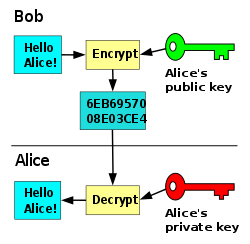

# 散列,数字签名与密码

# 主要参考资料

[Security: Integrity, Authentication, Non-repudiation, Lecture 20](https://www.cs.rutgers.edu/~sn624/352-S19/lectures/20-sec.pdf)

[System Security](https://www.lri.fr/~fmartignon/systeme_securite.html)

[352, Spring 2019: Internet Technology](https://www.cs.rutgers.edu/~sn624/352-S19)

[Foundations of Computer Security](https://www.cs.utexas.edu/~byoung/cs361/)

## 编码

- 用途
  - 方便二进制数据在文本协议里传输 (例如MIME, URL)
- 常用编码
  - Base16 / Hex
  - Base32
  - Base64
- Base16 / Hex 编码
  - 以每4比特为刻度编码, 16 == 2^4, 即每1字节编码为2字节
  - 码表: "0123456789ABCDEF", 不区分大小写
  - 编码效率: 编码后为源文件大小的2倍
- Base32 编码
  - 以每5比特为刻度编码, 32 == 2^5, 即每5字节编码为8字节
  - 码表: "ABCDEFGHIJKLMNOPQRSTUVWXYZ234567", 不区分大小写, 填充字符(可选): "="
  - 编码效率: 编码后为源文件大小的8/5
- Base64 编码
 - 以每6比特为刻度编码, 64 == 2^6, 即每3字节编码为4字节
 - 码表: "ABCDEFGHIJKLMNOPQRSTUVWXYZabcdefghijklmnopqrstuvwxyz0123456789+/", 填充字符(可选): "="
 - 编码效率: 编码后为源文件大小的4/3
- Base64Url 编码
  - 最常用的Base64变体. 把原Base64里的"+"和"/"分别替换为"-"和"_".
  - 码表: "ABCDEFGHIJKLMNOPQRSTUVWXYZabcdefghijklmnopqrstuvwxyz0123456789-_", 无填充字符
     
## 散列算法

- 定义
  - 把任意长度内容映射为定长的散列值的函数
- 性质
  - 一般性质
    - 变长输入
    - 定长输出
    - 伪随机性(置乱性, 均衡性)
    - 快速性
  - 加密用散列函数性质
    - 单向性(抗原相性)
    - 抗碰撞性(抗第二原相性)
    - 强伪随机性(敏感性, 均衡性, 非线性性)
- 功能
  - 分桶 (Hash Table)
  - 消息摘要 (Message Digest)
  - 完整性 (Integrity)
- 算法结构
  - 初始化状态向量, 把消息分块后, 级联非线性方程, 根据最终的状态向量输出
  - [常见的Hash算法(General Purpose Hash Function Algorithms)](https://blog.csdn.net/wwchao2012/article/details/80316862)
- 代表算法
  - (CRC-m 循环冗余校验码)
    - 原始帧与预先确定的除数(m+1位)进行模2除法运算，余数(m位)作为CRC校验码
    - 多用于底层通信的校验
    - 随机性差
    - [通信原理中CRC校验原理与过程](https://baijiahao.baidu.com/s?id=1608965002019598869&wfr=spider&for=pc)
  - SDBM
    - 通用散列算法, 分桶性能好
    - hash(i) = hash(i - 1)65599 + str[i]
    - [哈希(Hash)算法 DJB/ELF/PJW/SDBM/FNV1(a)](https://blog.csdn.net/wwchao2012/article/details/80329766)
  - BKDR
    - 通用散列算法, 可通过改变seed生成一组散列函数
    - [BKDRhash ](https://www.cnblogs.com/ldy-miss/p/6099454.html)
  - MD5 (Message Digest 5)
    - 四个状态变量, 四个非线性操作函数, 对每块(512位)进行64步计算
    - 摘要长度: 128位
    - 王小云于2004年破解
    - [信息摘要算法之一：MD5算法解析及实现 ](https://www.cnblogs.com/foxclever/p/7668369.html)
  - SHA1 (Secure Hash Algorithm 1)
    - 五个状态变量, 四个非线性操作函数, 对每块(512位)进行80步计算
    - 摘要长度: 160位散列值
    - 王小云于2005年破解
    - [信息摘要算法之二：SHA1算法分析及实现](https://www.cnblogs.com/foxclever/p/8282366.html)
  - SHA256
    - 八个状态变量, 六个非线性操作函数, 对每块(512位)进行64步计算
    - 摘要长度: 256位散列值
    - [比特币算法——SHA256算法介绍](https://blog.csdn.net/wowotuo/article/details/78907380)
- 高级应用简介
  - 工作量证明 (Proof-of-Work)
    - 
    - 常用于区块链
    - 计算H(message, counter), 直到散列值达到一定要求
  - 布伦过滤器 (Bloom Filter)
    - 常用于大数据集合, 数据库
    - 计算一个元素的k个散列值, 查看BitSet里这k个位的值, 如果BitSet包含这k个值, 元素可能在集合中, 否则元素一定不在集合中
    - 牺牲正确性, 以获得常数的时间和空间复杂度
  - 一致性哈希 (Consistent Hashing)
    - 常用于分布式缓存, 规避缓存雪崩
    - 利用哈希环, 保证原有的请求可以被映射到原有的或者新的服务器中去, 而不会被映射到原来的其它服务器上去
    - [深入浅出一致性Hash原理](https://www.jianshu.com/p/e968c081f563)
- 常见攻击
  - 暴力破解
    - 对抗: 强制信息的长度, 加盐(salt)
  - 生日攻击
    - [抗碰撞性、生日攻击及安全散列函数结构解析](https://blog.csdn.net/jerry81333/article/details/52763070/)
  - 长度扩展攻击
    - 利用MD5, SHA等散列函数直接把状态向量作为输出的漏洞, 把已知的散列值作为初始状态向量, 通过操纵明文的后缀, 来获取特定的散列值.
    - 
    - 能有效规避加盐(salt)
    - 对抗: HMAC
    - [MD5的Hash长度扩展攻击](https://www.cnblogs.com/p00mj/p/6288337.html)

## HMAC

- 定义
  - 利用散列算法(Hash)，以一个密钥和一个消息为输入，生成一个消息摘要作为消息认证码 (MAC).
  - `HMAC（K，M）=H（K⊕opad∣H（K⊕ipad∣M）`
  - 
  - 
  - [rfc2104](https://tools.ietf.org/html/rfc2104)
- 算法结构
  - [HMAC的图解](https://blog.csdn.net/chengqiuming/article/details/82822933)
  - [知乎: HMAC与MAC算法在密码学的区别？](https://www.zhihu.com/question/26605600/answer/33382509)
- 功能
  - 完整性 (Integrity)
  - 可认证性 (authenticity)
- 安全性
  - 引入了密钥，其安全性已经不完全依赖于所使用的HASH算法
  - 能对抗暴力破解和长度扩展攻击
- 应用
  - “质疑/应答”(Challenge/Response)
    - 
    - 注册时, 分发给用户API Key (key)
    - 验证时, 发送一段随机字符串(challenge)给用户
    - 用户计算HMAC(key, challenge), 并发送回服务器
    - 服务器计算HMAC(key, challenge), 验证用户身份
  - JWT (JSON Web Token)
    - 在前后端分离的网页或Restful API中, 取代Session.
    - 格式: header.playload.signature, 各部分以base64Url编码后, 以'.'分隔, signature支持以HMAC"签名"
    - 好处
      - 支持跨域 
      
      - 服务层无状态
      - 可自定义载荷
    - JWT 问题
      - 有效期问题(用户登出, JWT任然有效)
      - 默认不加密
      - 盗用
      
## 加密算法

- 性质
  - 混淆(Confusion)
  - 扩散(Diffusion)
    - 完全性 (Completeness): 每个输出位由多数输入位决定
    - 雪崩效应 (Avalanche effect): 一个输入位改变会导致整个密文改变
  - [Lecture 39:  Properties of Ciphers](https://www.cs.utexas.edu/~byoung/cs361/lecture39.pdf)  
- 按方式分类
  - 分组加密
    
    - 对明文进行分块，再对每一块进行加密
    - 例: DES, AES
    - 常见填充方式: 
      - ZeroPadding: 直接补零. 
      - PKCS7Padding: 块大小可自定义. 如果原文需要填充, 则填充n个值为n的字节.
      - PKCS5Padding: PKCS7Padding子集, 定义块大小为8.
    - 优点:
      - 扩散度高
      - 可保证完整性
      - 可伸缩性(malleability)低
    - 缺点: 
      - 速度慢
      - 错误传播
  - 串流加密
    
    - 明文数据每次与密钥数据流(例如伪随机加密数据流)顺次对应加密
    - 例: Cesar, One-Time-Pad, RC4 (WEP加密方法)
    - 优点:
      - 速度快
      - 无错误传播
    - 缺点: 
      - 扩散度低
      - 不保证完整性
      - 可伸缩性(malleability)高
  - [Lecture 45: Stream and Block Encryption](https://www.cs.utexas.edu/~byoung/cs361/lecture45.pdf)
- 按密钥分类
  - 对等 / 私钥加密 (Symmetric / Private Key Encryption)
  
  
  - 非对等 / 公钥加密 (Asymmetric / Public Key Encryption)
  
- 基本加密算法
  - 取代加密(Substitution)
    - 增加非线性型
  - 换位加密(Transposition)
    - 增加扩散性
- 历史
  - 凯撒加密 (Cesar Cypher)
    
    - 明文中的所有字母都在字母表上向后（或向前）按照一个固定数目进行偏移后被替换成密文
  - 维吉尼亚加密 (Vigenère Cipher)
    - 使用一系列凯撒密码组成密码字母表的加密算法
  - 一次性密码本 (One-Time-Pad)
    
    - 密码随机, 长度至少等于明文, 且只使用一次
    - (信息学)理论上的的完美加密(Perfect cypher)
    - 实践中, 易受到明文攻击 
      - 已知明文`P`, 密文`P xor K`, 可伪造 `P xor K xor K2`, 使其解密为`P xor K2`. 
- 常见问题
  - 密钥分发
  - 密钥管理
  
## 对等 / 私钥加密 (Symmetric / Private Key Encryption)

- 定义 
  
  - 加密和解密都使用同一个密钥的加密方法
 
- 密钥分发
  - 通过非对称加密算法
- 密钥管理
  - n^2个密钥以确定n个个体点对点加密
  
- 常见结构
  - Feistel Cipher
  
    
- 常见攻击
  - 暴力破解
  - 字典攻击 (Dictionary Attack)
  - 频率分析 (Frequency Analysis)
  - 重放攻击 (Replay Attack)
  - 功耗分析 (Power Analysis)
  - 时间分析 (Timing Analysis)
  - 差分分析 (Differential Analysis)
  - [Attacks on Symmetric Key](https://www.cs.clemson.edu/course/cpsc424/material/Cryptography/Attacks%20on%20Symmetric%20Key.pdf)
  - [Week9 - part 2 - Symmetric Key Encryption.pdf](https://www.ics.uci.edu/~stasio/ics8-w12/Week9%20-%20part%202%20-%20Symmetric%20Key%20Encryption.pdf)

- 代表算法
  - RC4
  
  - DES (Data Encryption Standard)
    - 块长度: 64 位
    - 密钥长度: 56位有效密钥 + 8位奇偶校验码 = 64位
    - 循环步数: 16
    - 基本结构 
    
      - 初始和结束置换
      无实际密码学意义
      
      - Key Generation
      生成循环密钥
      
      - Round Function
      
        - Expansion P Box
        
        - Whitener
        与循环密钥XOR 
        - S-Boxes
        
        
        - Straight Permutation
        
  
  - 3DES (Tripple DES)
    - `E(D(E(M, K1), K2), K3)` 
    - 基本结构 
    
    - 当三个密钥互不相关, 密钥长度为118位.
    - 当三个密钥完全相同, 兼容DES.
    - 2DES是否相对安全?
      - `C = E(E(M, K1), K2)`
      - Meet In the Middle Attack, 明文攻击, 已知明文M和密文C
        1. 预计算`E(M, Kn) for all Kn`
        2. 计算`D(C, Km) for all Km`, 与预计算匹配
        - 空间复杂度: 2^56, 时间复杂度: 2^56
      
  - AES (Advanced Encryption Standard)
    - 块长度: 128 位
    - 密钥长度: 128, 192, 以及256 位
    - 循环步数: 10(128位), 12(192位), 14(256位) 
    - 基本结构 
      
        - 循环:
          
          每16字节(128位)被安排为4x4矩阵
          1. subBytes
          每个字节被置换
          2. shiftRows
          每行按行数平移
          3. mixColumns
          每列经过计算, 生成新的列, 并替换原始列
          4. addRoundKey
          与循环密钥XOR 
    - [Lecture 46: Advanced Encryption Standard](https://www.cs.utexas.edu/~byoung/cs361/lecture46.pdf)
  
- 加密模式 ()
  - 
  
## 非对等 / 公钥加密 (Asymmetric / Public Key Encryption)

- 定义 
  
  - 由对应的一对唯一性密钥（即公开密钥和私有密钥）组成的加密方法
  
- 常见问题
  - 密钥分发
    - 通过CA分发公钥
  - 密钥管理
    - n对密钥以确定n个个体点对点加密
      
## 数字签名 / 私钥签名 (Digital Signature / Private Key Signing)
    
- 定义
  
  - 使用了公钥加密领域的技术实现，用于鉴别数字信息的方法
  - 注意与加密的区别 
  
- 功能
  - 完整性 (Integrity)
  - 可认证性 (Authenticity)
  - 不可否认性  (Non-repudiation)

- 问题
  - 使用非对称加密文件本身效率低
  - 解决办法：对文件的散列值签名
  
- 常用算法
  - Md5withRSA
  - SHA1withRSA
  - 

## 散列, HMAC与数字签名的对比

[What are the difference between a digital signature, a MAC and a hash](https://crypto.stackexchange.com/questions/5646/what-are-the-differences-between-a-digital-signature-a-mac-and-a-hash/5647#5647)

- 完整性 (Integrity): 接收方能否确认信息未被修改?

- 可认证性 (Authenticity): 接收方能否确认信息来自发送方?

- 不可否认性 (Non-repudiation): 如果接收方把信息转交给第三方,第三方能否确认信息源自发送方?

| 安全性能           | 加密用散列 |    MAC    |  数字签名             |
|:------------------|:---------:|:---------:|:--------------------:|
| 完整性             |  Yes      |    Yes    |   Yes                |
| 可认证性           |  No       |    Yes    |   Yes                |
| 不可否认性         |  No       |    No     |   Yes                |
|-------------------|-----------|-----------|----------------------|
| 密钥类型           | 无        | 对称       | 非对称                |