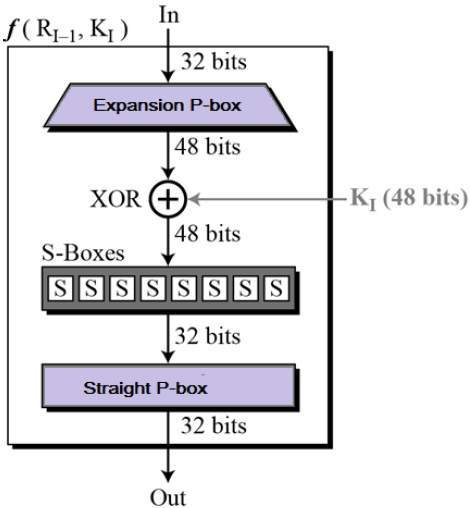
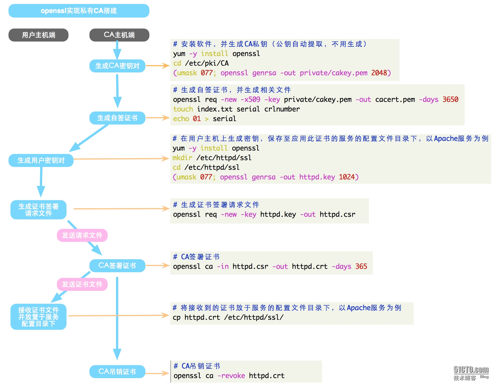

# 散列,数字签名与密码

# 主要参考资料

[Security: Integrity, Authentication, Non-repudiation, Lecture 20](https://www.cs.rutgers.edu/~sn624/352-S19/lectures/20-sec.pdf)

[System Security](https://www.lri.fr/~fmartignon/systeme_securite.html)

[352, Spring 2019: Internet Technology](https://www.cs.rutgers.edu/~sn624/352-S19)

[Foundations of Computer Security](https://www.cs.utexas.edu/~byoung/cs361/)

## 基编码(Base Encoding)

- 目的
  
  - 方便二进制数据在文本协议里传输 (例如MIME, URL)
  
  - 方便使用文本编辑器编辑二进制数据

- 常用编码

  - 基16编码 (Base16 / Hex)
    
    - 以每4比特为刻度编码, 16 == 2^4, 即每1字节编码为2字节
    
    - 码表: "0123456789ABCDEF", 不区分大小写
    
    - 编码效率: 编码后为源文件大小的2倍
    
  - 基32编码 (Base32) 
    
    - 以每5比特为刻度编码, 32 == 2^5, 即每5字节编码为8字节
    
    - 码表: "ABCDEFGHIJKLMNOPQRSTUVWXYZ234567", 不区分大小写
    
    +- 填充字符(可选): "="
    
    - 编码效率: 编码后为源文件大小的8/5
    
  - 基64编码 (Base64)
    
    - 以每6比特为刻度编码, 64 == 2^6, 即每3字节编码为4字节
    
    - 码表: "ABCDEFGHIJKLMNOPQRSTUVWXYZabcdefghijklmnopqrstuvwxyz0123456789+/"
     
    - 填充字符(可选): "="
    
    - 编码效率: 编码后为源文件大小的4/3
    
  - 基64URL编码 Base64Url
      
    - 最常用的Base64变体. 把原Base64里的"+"和"/"分别替换为"-"和"_". 
      
    - 码表: "ABCDEFGHIJKLMNOPQRSTUVWXYZabcdefghijklmnopqrstuvwxyz0123456789-_"
    
    - 无填充字符
     
- 应用
   
  - Data URL里传输二进制文件
  
    - 例: 使用HTML5的FileReader生成本地图片预览

## 散列算法


- 定义

  - 把任意长度内容映射为定长的散列值的函数
  
- 性质
 
  - 一般性质
    
    - 变长输入
    
    - 定长输出
    
    - 伪随机性(置乱性, 均衡性)
    
    - 快速性
  
  - 加密用散列函数性质
  
    - 单向性(抗原相性)
   
    - 抗碰撞性(抗第二原相性)
   
    - 强伪随机性(敏感性, 均衡性, 非线性性)
    
- 目的
  
  - 分桶 (Hash Table)
  
  - 消息摘要 (Message Digest)
  
  - 完整性 (Integrity)
  
- 算法结构
  
  - 初始化状态向量, 把消息分组后, 级联非线性方程, 根据最终的状态向量输出
  
  - [常见的Hash算法(General Purpose Hash Function Algorithms)](https://blog.csdn.net/wwchao2012/article/details/80316862)

- 代表算法
  
  - (CRC-m 循环冗余校验码)
  
  
  
    - 原始帧与预先确定的除数(m+1位)进行模2除法运算，余数(m位)作为CRC校验码
   
    - 多用于底层通信的校验
   
    - 随机性差
   
    - [通信原理中CRC校验原理与过程](https://baijiahao.baidu.com/s?id=1608965002019598869&wfr=spider&for=pc)
  - SDBM
   
    - 通用散列算法, 分桶性能好
    
    - hash(i) = hash(i - 1)65599 + str[i]
    
    - [哈希(Hash)算法 DJB/ELF/PJW/SDBM/FNV1(a)](https://blog.csdn.net/wwchao2012/article/details/80329766)
  
  - BKDR
    
    - 通用散列算法, 可通过改变seed生成一组散列函数
    
    - [BKDRhash ](https://www.cnblogs.com/ldy-miss/p/6099454.html)
  
  - MD5 (Message Digest 5)
  
    
  
    - 四个状态变量, 四个非线性操作函数, 对每块(512位)进行64步计算
    
    - 摘要长度: 128位
    
    - 王小云于2004年破解
    
    - [信息摘要算法之一：MD5算法解析及实现 ](https://www.cnblogs.com/foxclever/p/7668369.html)
  
  - SHA1 (Secure Hash Algorithm 1)
  
    
    
    - 五个状态变量, 四个非线性操作函数, 对每块(512位)进行80步计算
    
    - 摘要长度: 160位散列值
    
    - 王小云于2005年破解
    
    - [信息摘要算法之二：SHA1算法分析及实现](https://www.cnblogs.com/foxclever/p/8282366.html)
 
  - SHA256
   
    - 八个状态变量, 六个非线性操作函数, 对每块(512位)进行64步计算
    
    - 摘要长度: 256位散列值
    
    - [比特币算法——SHA256算法介绍](https://blog.csdn.net/wowotuo/article/details/78907380)

- 应用

  - 伪随机数

  - Web API 混淆ID (Hash ID)
    
    - 不表现出递增的特征, 防止爬取
    
    - 例:
    
      - 对id加盐后, 求散列值
      
      - 对内容求散列值
      
  - 工作量证明 (Proof-of-Work)
    
    - 
    
    - 比特币区块链通过竞争记账方式解决去中心化的账本一致性问题
    
    - 通过工作量证明算法使得区块链历史数据实际上不可更改
    
    - 工作量证明方程: 满足难度目标(前置零的个数)的散列值`H(message, nounce)`
    
    - [区块链共识技术一:pow共识机制](https://www.jianshu.com/p/1026fb3c566f)
  
  - 布伦过滤器 (Bloom Filter)
  
    
    
    - 常用于大数据集合, 数据库
    
    - 计算一个元素的k个散列值, 查看BitSet里这k个位的值, 如果BitSet包含这k个值, 元素可能在集合中, 否则元素一定不在集合中
    
    - 牺牲正确性, 以获得常数的时间和空间复杂度
    
    - [布隆过滤器 -- 空间效率很高的数据结构](https://segmentfault.com/a/1190000002729689)
  
  - 一致性哈希 (Consistent Hashing)
    
    
    
    
    
    - 常用于分布式缓存, 规避缓存雪崩
    
    - 利用哈希环, 保证内容可以被映射到原来的或者新的节点中去, 而不会被映射到原有的其它节点上去
    
    - 一致性哈希要求键值和节点ID处于同一值域(哈希环), 而不用取模操作. 内容将被存储到具有与其键值最接近的ID的节点上
    
    - [深入浅出一致性Hash原理](https://www.jianshu.com/p/e968c081f563)
 
  - 散列链一次性口令
    
    - 散列链是一种由单个密钥或密码生成多个一次性密钥或密码的一种方法. 例如`h^4(x) = h(h(h(h(x))))`
    
    - 作为一种在非安全环境中的密码保护方案
      
      - 服务器储存用户提供的口令`h^1000(password)`
      
      - 验证时, 用户提供`h^999(password)`, 服务器验证`h(h^999(password))`
      
      - 如果验证成功, 服务器更新口令为`h^999(password)`
    
    - [哈希链](https://baike.baidu.com/item/%E5%93%88%E5%B8%8C%E9%93%BE/10230309)
    
- 常见攻击
  
  - 暴力破解
    
    - 对抗: 强制信息的长度, 加盐(salt)
  
  - 生日攻击
    
    - [抗碰撞性、生日攻击及安全散列函数结构解析](https://blog.csdn.net/jerry81333/article/details/52763070/)
  
  - 长度扩展攻击
    
    - 利用MD5, SHA等散列函数直接把状态向量作为输出的漏洞, 把已知的散列值作为初始状态向量, 通过操纵明文的后缀, 来获取特定的散列值.
    
    - 
    
    - 能有效规避加盐(salt)
    
    - 对抗: HMAC
    
    - [MD5的Hash长度扩展攻击](https://www.cnblogs.com/p00mj/p/6288337.html)

## HMAC

- 定义

  - 利用散列算法(Hash)，以一个密钥和一个消息为输入，生成一个消息摘要作为消息认证码 (MAC).
  
  - `HMAC（K，M）=H（K⊕opad∣H（K⊕ipad∣M）`
  
  - 
  
  - 
  
  - [rfc2104](https://tools.ietf.org/html/rfc2104)
  
- 算法结构
  
  - [HMAC的图解](https://blog.csdn.net/chengqiuming/article/details/82822933)
  
  - [知乎: HMAC与MAC算法在密码学的区别？](https://www.zhihu.com/question/26605600/answer/33382509)

- 目的

  - 完整性 (Integrity)
  
  - 可认证性 (authenticity)
  
- 安全性与常见攻击
  
  - 引入了密钥，其安全性已经不完全依赖于所使用的HASH算法, 能对抗暴力破解和长度扩展攻击
  
  - 重放攻击
  
- 应用
  
  - “质疑/应答”(Challenge/Response)
    
    - 
    
    - 注册时, 分发给用户API Key (key)
    
    - 验证时, 发送一段随机字符串(challenge)给用户
    
    - 用户计算HMAC(key, challenge), 并发送回服务器
    
    - 服务器计算HMAC(key, challenge), 验证用户身份
  
  - JWT (JSON Web Token)
    
    - 在前后端分离的网页或Restful API中, 取代Session.
    
    - 格式: header.playload.signature, 各部分以base64Url编码后, 以'.'分隔, signature支持以HMAC"签名"
    
    - 好处
    
      - 支持跨域 
      
      
      
      - 服务层无状态
      
      - 可自定义载荷
      
    - JWT 问题
    
      - 有效期问题(用户登出, JWT任然有效)
      
      - 默认不加密
      
      - 盗用
      
## 加密算法

- 性质

  - 混淆(Confusion)
  
  - 扩散(Diffusion)
  
    - 完全性 (Completeness): 每个输出位由多数输入位决定
    
    - 雪崩效应 (Avalanche effect): 一个输入位改变会导致整个密文改变
    
  - [Lecture 39:  Properties of Ciphers](https://www.cs.utexas.edu/~byoung/cs361/lecture39.pdf)  

- 按方式分类

  - 分组加密
  
    
    
    - 对明文进行分组，再对每一块进行加密
    
    - 例: DES, AES
    
    - 常见填充方式: 
    
      - ZeroPadding: 直接补零. 
      
      - PKCS7Padding: 块大小可自定义. 如果原文需要填充, 则填充n个值为n的字节.
      
      - PKCS5Padding: PKCS7Padding子集, 定义块大小为8.
      
    - 优点
    
      - 扩散度高
      
      - 可保证完整性
      
      - 可伸缩性(malleability)低
      
    - 缺点: 
    
      - 速度慢
      
      - 错误传播
      
  - 串流加密
  
    
    
    - 明文数据每次与密钥数据流(例如伪随机加密数据流)顺次对应加密
    
    - 例: Cesar, One-Time-Pad, RC4 (WEP加密方法)
    
    - 优点:
    
      - 速度快
      
      - 无错误传播
      
    - 缺点: 
    
      - 扩散度低
      
      - 不保证完整性
      
      - 可伸缩性(malleability)高
      
  - [Lecture 45: Stream and Block Encryption](https://www.cs.utexas.edu/~byoung/cs361/lecture45.pdf)

- 按密钥分类

  - 对等 / 私钥加密 (Symmetric / Private Key Encryption)
  
  
  
  - 非对等 / 公钥加密 (Asymmetric / Public Key Encryption)
  
  
  
- 基本加密算法

  - 取代加密(Substitution)
  
    - 增加非线性型
    
  - 换位加密(Transposition)
  
    - 增加扩散性
    
- 历史

  - 凯撒加密 (Cesar Cypher)
  
    
    
    - 明文中的所有字母都在字母表上向后（或向前）按照一个固定数目进行偏移后被替换成密文
    
  - 维吉尼亚加密 (Vigenère Cipher)
  
    - 使用一系列凯撒密码组成密码字母表的加密算法
    
  - 一次性密码本 (One-Time-Pad)
  
    
    
    - 密码随机, 长度至少等于明文, 且只使用一次
    
    - (信息学)理论上的的完美加密(Perfect cypher)
    
    - 实践中, 易受到明文攻击 
    
      - 已知明文`P`, 密文`P xor K`, 可伪造 `P xor K xor K2`, 使其解密为`P xor K2`. 

- 常见问题

  - 密钥分发
  
  - 密钥管理
  
## 对等 / 私钥加密 (Symmetric / Private Key Encryption)

- 定义 

  
  
  - 加密和解密都使用同一个密钥的加密方法

- 目的

  - 私密性 (Privacy / Confidentiality)
  
  - 完整性 (Integrity)
  
  - 可认证性 (Authenticity)
 
- 密钥分发

  
  
  - 例如: 通过非对称加密算法
  
- 密钥管理

  - n^2个密钥以确定n个个体点对点加密
  
- 常见结构

  - Feistel Cipher
  
  
  
    - 一致的加解密结构, 节省硬件实现的成本
    
    - 设计原则
    
      - 块的大小
      
      - 密钥的大小
      
      - 循环次数（轮次数）
      
      - 循环密钥的生成算法
      
      - 轮函数的复杂度
      
      [Feistel](https://baike.baidu.com/item/Feistel/1985068)
    
- 常见攻击

  - 暴力破解
  
  - 差分分析 (Differential Analysis)
  
  - 字典攻击 (Dictionary Attack)
  
  - 频率分析 (Frequency Analysis)
  
  - 重放攻击 (Replay Attack)
  
  - 功耗分析 (Power Analysis)
  
  - 时间分析 (Timing Analysis)
  
  - [Attacks on Symmetric Key](https://www.cs.clemson.edu/course/cpsc424/material/Cryptography/Attacks%20on%20Symmetric%20Key.pdf)
  
  - [Week9 - part 2 - Symmetric Key Encryption.pdf](https://www.ics.uci.edu/~stasio/ics8-w12/Week9%20-%20part%202%20-%20Symmetric%20Key%20Encryption.pdf)

- 代表算法

  - DES (Data Encryption Standard)
  
    - 块长度: 64 位
    
    - 密钥长度: 56位有效密钥 + 8位奇偶校验码 = 64位
    
    - 循环步数: 16
    
    - 基本结构 
    
    
    
    [Feistle Cipher](https://www.tutorialspoint.com/cryptography/feistel_block_cipher.htm)
    
      - 初始和结束置换
      
      无实际密码学意义
      
      
      
      - Key Generation
      
      生成循环密钥
      
      
      
      - Round Function
      
      
      
      - Expansion P Box
        
      
        
      - Whitener
        
      与循环密钥XOR 
        
      - S-Boxes
        
      
        
      
        
      - Straight Permutation
        
      
  
  - 3DES (Tripple DES)
  
    - `E(D(E(M, K1), K2), K3)` 
    
    - 基本结构 
    
    
    
    - 当三个密钥互不相关, 密钥长度为118位.
    
    - 当三个密钥完全相同, 兼容DES.
    
    - 2DES是否相对安全?
    
      - `C = E(E(M, K1), K2)`
      
      - Meet In the Middle Attack, 明文攻击, 已知明文M和密文C
      
        1. 预计算`E(M, Kn) for all Kn`
        
        2. 计算`D(C, Km) for all Km`, 与预计算匹配
        
        - 空间复杂度: 2^56, 时间复杂度: 2^56
      
  - AES (Advanced Encryption Standard)
  
    - 块长度: 128 位
    
    - 密钥长度: 128, 192, 以及256 位
    
    - 循环步数: 10(128位), 12(192位), 14(256位) 
    
    - 基本结构 
    
      
      
        - 循环:
        
          
          
          每16字节(128位)被安排为4x4矩阵
          
          1. subBytes
          
          每个字节被置换
          
          
          
          2. shiftRows
          
          每行按行数平移
          
          
          
          3. mixColumns
          
          每列经过计算, 生成新的列, 并替换原始列
          
          
          
          4. addRoundKey
          
          与循环密钥XOR
          
    - [Lecture 46: Advanced Encryption Standard](https://www.cs.utexas.edu/~byoung/cs361/lecture46.pdf)
  
  - 其他算法:
  
    - RC4 / RC5
    
    - Blowfish
    
    - IDEA
 
- 分组密码的加密模式(迭代方法) (Encryption Mode)

  - ECB (Electronic Code Book)
  
  
  
  
  
  
  
  - 优点
  
    - 并行计算
    
  - 缺点
  
    - 确定性 (Deterministic)
    
    - 易受字典攻击 (Dictionary Attack)
  
  - CBC (Cipher Block Chaining)
  
  
  
  
  
  - 优点
  
    - 伪随机性
    
  - 缺点
  
    - 错误传播广
    
    - 串行计算
  
  - OFB (Output Feedback)
  
  
  
  
  
  - 优点
  
    - 伪随机性
    
    - 错误隔离
    
  - 缺点
  
    - 串行计算
  
  - CFB (Cipher Feedback)
  
  
  
  
  
  - 优点
  
    - 伪随机性
    
  - 缺点
  
    - 错误影响临近块
    
    - 串行计算
  
  - CTR (Counter)
  
  
  
  
  
  - 优点
    - 伪随机性
    - 随机访问
    - 预计算
    - 并行计算
    - 错误隔离
    
  - [加密技术简介](https://blog.csdn.net/weixin_28774815/article/details/81359015)
  
## 非对等 / 公钥加密 (Asymmetric / Public Key Encryption)

- 定义 
  
  - 由对应的一对唯一性密钥（即公开密钥和私有密钥）组成的加密方法
  
- 特点
  
  - 密钥成对出现
  
  - 公钥加密的信息只能私钥解开，私钥加密的信息只能公钥解开
  
  - 信息传输1对多

- 目的

  - 私密性 (Privacy)
  
  - 完整性 (Integrity)
  
  - 可认证性 (Authenticity)
  
  - 不可否认性  (Non-repudiation)
  
- 密钥分发
    
  
   
  - 通过证书机构CA分发公钥
    
- 密钥管理
  
  - n对密钥以确定n个个体点对点加密
    
- 代表算法

  - RSA
  
    - 数论基础
    
      - 欧拉函数(φ(1)): 对正整数n，欧拉函数是小于n的正整数中与n互质的数的数目(φ(1)=1) 
        - [欧拉函数](https://baike.baidu.com/item/%E6%AC%A7%E6%8B%89%E5%87%BD%E6%95%B0/1944850?fr=aladdin)
      
      - 欧拉函数性质
        - 当`n=pq`, `p`和`q`为质数时, `φ(n) = (p-1)(q-1)`
        - 当`p`为质数时, `φ(p) = (p-1)`
        
      - 欧拉定理: `a^φ(n) ≡ 1 (mod n)`.
      
        - [费马小定理、欧拉定理与扩展欧拉定理](https://blog.csdn.net/hzj1054689699/article/details/80693756)
      
      - 扩展欧几里德算法
        
        - 已知`a`, `b`求解一组`x`，`y`使得`ax+by = Gcd(a, b) =d`
        
        - [扩展欧几里德算法](https://baike.baidu.com/item/%E6%89%A9%E5%B1%95%E6%AC%A7%E5%87%A0%E9%87%8C%E5%BE%B7%E7%AE%97%E6%B3%95/1053275?fr=aladdin)
    - 思想
    
      - 对任意整数k, `M^(k*φ(n)) ≡ 1 (mod n)` [欧拉定理]
      
      - `M^(k*φ(n)+1) ≡ M (mod n)` 当 `M < n`
      
      - `M^(e*d) ≡ M (mod n)`, 当 `e*d = 1 (mod φ(n))`
      
      - 可任已选择`e` (如3), 求解`d` [扩展欧几里德算法]
      
      - 密钥对为`(e, n)` 和 `(d, n)`
      
    - 加密
    
      - `C = M^e`
    
    - 解密
    
      - `M = C^d`
      
- 其他算法
  
  - 椭圆曲线密码 (ECC)
  
- 缺点
  
  - 计算复杂，加密速度慢

- 常见攻击
  
  - 中间人攻击
  
- 应用

  - 数字签名
  
  - 交换对称加密的密钥
  
## 数字签名 / 私钥签名 (DSA / Digital Signature / Private Key Signing)
    
- 定义

  
  
  - 使用了公钥加密领域的技术实现，用于鉴别数字信息的方法
  
  - 注意与加密的区别
  
  Digital Signature Algorithm:
  
   
  
  Public Key Encryption:
  
  
  
- 目的

  - 完整性 (Integrity)
  
  - 可认证性 (Authenticity)
  
  - 不可否认性  (Non-repudiation)

- 消息摘要与数字签名

  - 使用非对称加密原始文件效率低
  
  - 解决办法：由于`H(M)`与`M`等效, 对文件的消息摘要签名
  
  - 例如: Md5withRSA 先计算MD5消息摘要, 再用RSA对消息摘要签名
  
- 签名核心算法

  - RSA: 使用RSA加密算法的签名方法
  
  - DSA: 由DSS(数字签名标准)定义的基于RSA的签名算法. RSA签名的子集.
  
  - ECDSA: 椭圆曲线数字签名算法
  
- 常用算法

  - Md5withRSA / Md5withDSA
  
  - SHA1withRSA / SHA1withDSA
  
  - RSA2 / SHA256withRSA [RSA和RSA2签名算法区别 ](https://docs.open.alipay.com/291/106115)
  
- 应用

  - TLS/SSL协议
  
  - 数字签名
  
  - 电子政务 
    
    - [让群众少跑腿，政府工作报告说要这么干 ](http://www.sohu.com/a/302489296_100143761)

- 散列, HMAC与数字签名的对比
    
  - 完整性 (Integrity): 接收方能否确认信息未被修改?
    
  - 可认证性 (Authenticity): 接收方能否确认信息来自发送方?
    
  - 不可否认性 (Non-repudiation): 如果接收方把信息转交给第三方,第三方能否确认信息源自发送方?
    
    | 安全性能           | 加密用散列 |    MAC    |  数字签名             |
    |:------------------|:---------:|:---------:|:--------------------:|
    | 完整性             |  Yes      |    Yes    |   Yes                |
    | 可认证性           |  No        |    Yes    |   Yes               |
    | 不可否认性         |  No        |    No     |   Yes                |
    | 密钥类型           |  无        | 对称       | 非对称               |

  [What are the difference between a digital signature, a MAC and a hash](https://crypto.stackexchange.com/questions/5646/what-are-the-differences-between-a-digital-signature-a-mac-and-a-hash/5647#5647)
  
## 公钥基础设施 (PKI, Public Key Infrastructure)

- 定义

  - 包括硬件、软件、人员、策略和规程的集合，用来实现基于公钥密码体制的密钥和证书的产生、管理、存储、分发和撤销等功能. [公钥基础设施](https://baike.baidu.com/item/%E5%85%AC%E9%92%A5%E5%9F%BA%E7%A1%80%E8%AE%BE%E6%96%BD/10881894?fr=aladdin)

- 目的

  - 提供身份认证、数据完整性、数据保密性、数据公正性、不可抵赖性和时间戳六种安全服务
  
  - 例如: 确定HTTPS服务器所发放的公钥是真实的, 而不是中间人伪造的.
  
- 组成要素

  - PKI策略
  
    - 公钥技术, 数字证书, 数据完整性算法
  
  - 软硬件系统
  
  - 证书机构CA (Certificate Authority)
  
    - 发放证书、规定证书的有效期和废除证书
    
  - 注册机构RA (Register Authority)
  
    - 获取并认证用户的身份，向CA提出证书请求
    
  - 证书发布系统
  
    - 
    
    - 
    
  - PKI应用

- 数字证书 (Digital Certificate / X.509 Certificate)
  
  - 主要内容
  
    - 公钥

    - 申请人身份信息
    
    - 有效期
    
    - CA对证书的数字签名
    
    [数字证书详解](https://www.jianshu.com/p/3371740b7b02)
    
  - 自签名证书 (Self-Signed Certificate) 
  
    - 生成过程 (以OpenSSL为例)
     
      1. 生成私钥
       
       ```sh
       openssl genrsa -aes256 -out privkey.pem 2048
       ```
      
      2. 生成证书请求
       
        ```sh
        openssl req -new -key privkey.pem -out signreq.csr -subj "/CN=docker.local"
        ```
      
      3. 用步骤1中的私钥签发证书
      
        ```sh
        openssl x509 -req -days 365 -in signreq.csr -signkey privkey.pem -out certificate.crt
        ```
      
    - 一键生成
      
      - OpenSSL
      
      ```sh
      openssl req \
          -x509 \
          -sha256 \
          -newkey rsa:2048 \
          -keyout certificate.key \
          -keyform PEM \
          -out certificate.crt \
          -outform PEM \
          -days 1024 \
          -nodes -subj "/CN=nginxhttps"
      ```
      
      - Java Keytool

      ```sh
      keytool -genkey \
          -alias server \
          -keyalg RSA \
          -storepass testtest \
          -keypass testtest \
          -dname "CN=localhost" \
          -keystore server.jks
      ```
      
  - 搭建私有CA及签发证书 (以OpenSSL为例)
  
    
  
    
    
    - 根CA搭建
    
      - 配置
            
      ```config
      ####################################################################
      [ ca ]
      default_ca      = CA_default            # 默认的CA配置；CA_default指向下面配置块
      
      ####################################################################
      [ CA_default ]
      
      dir             = /etc/pki/CA           # CA的默认工作目录
      certs           = $dir/certs            # 认证证书的目录
      crl_dir         = $dir/crl              # 证书吊销列表的路径
      database        = $dir/index.txt        # 数据库的索引文件
      
      
      new_certs_dir   = $dir/newcerts         # 新颁发证书的默认路径
      
      certificate     = $dir/cacert.pem       # 此服务认证证书，如果此服务器为根CA那么这里为自颁发证书
      serial          = $dir/serial           # 下一个证书的证书编号
      crlnumber       = $dir/crlnumber        # 下一个吊销的证书编号
                                              
      crl             = $dir/crl.pem          # The current CRL
      private_key     = $dir/private/cakey.pem# CA的私钥
      RANDFILE        = $dir/private/.rand    # 随机数文件
      
      x509_extensions = usr_cert              # The extentions to add to the cert
      
      name_opt        = ca_default            # 命名方式，以ca_default定义为准
      cert_opt        = ca_default            # 证书参数，以ca_default定义为准
      
      
      default_days    = 365                   # 证书默认有效期
      default_crl_days= 30                    # CRl的有效期
      default_md      = sha256                # 加密算法
      preserve        = no                    # keep passed DN ordering
      
      
      policy          = policy_match          #policy_match策略生效
      
      # For the CA policy
      [ policy_match ]
      countryName             = match         #国家；match表示申请者的申请信息必须与此一致
      stateOrProvinceName     = match         #州、省
      organizationName        = match         #组织名、公司名
      organizationalUnitName  = optional      #部门名称；optional表示申请者可以的信息与此可以不一致
      commonName              = supplied
      emailAddress            = optional
      
      # For the 'anything' policy
      # At this point in time, you must list all acceptable 'object'
      # types.
      [ policy_anything ]                     #由于定义了policy_match策略生效，所以此策略暂未生效
      countryName             = optional
      stateOrProvinceName     = optional
      localityName            = optional
      organizationName        = optional
      organizationalUnitName  = optional
      commonName              = supplied
      emailAddress            = optional
      ```
    
      - 生成证书索引数据库文件
      
      ```sh
      touch /etc/pki/CA/index.txt 
      ```
      
      - 生成序列号文件
      
      ```
      echo 01 > /etc/pki/CA/serial
      ```
      - 生成根CA私钥和自签名证书
      
      ```sh
      openssl req \
          -x509 \
          -sha256 \
          -newkey rsa:2048 \
          -keyout /etc/pki/CA/private/cakey.pem \
          -out /etc/pki/CA/cacert.pem \
          -days 1024 \
          -nodes \
          -subj "/C=CN/ST=SC/L=CD/O=chaoxing/OU=dev/CN=privateCA"
      ```
      
    - 生成Web服务器证书申请 
    
      - 生成密钥
       
       ```sh
       openssl genrsa \
           -aes256 \
           -passout pass:testtest \
           -out /etc/pki/tls/private/docker.local.pem 2048
       ```
       
      - 生成证书申请 
      
      ```sh
      openssl req \
          -new \
          -passin pass:testtest \
          -key /etc/pki/tls/private/docker.local.pem \
          -out /etc/pki/tls/certs/docker.local.csr \
          -subj "/C=CN/ST=SC/L=CD/O=chaoxing/OU=dev/CN=docker.local"
      ```
      
      - 上传证书申请给CA服务器
      
    - 根CA签发Web服务器证书
    
      - 签发证书
      
      ```sh
      openssl ca \
          -in /etc/pki/tls/certs/docker.local.csr \
          -out /etc/pki/CA/certs/docker.local.crt \
          -batch \
          -days 365
      ```
      
      - 返回证书给Web服务器
    
    [私有CA服务器的搭建](https://www.jianshu.com/p/9142d9d186e2)
    
  - Nginx 安装数字证书
      
    - 监听SSL端口
        
    - 配置私钥, 证书
      
    ```config
    server {
      ...
      listen 443 ssl;
      ssl_certificate /nginxhttps/nginxhttps.crt;
      ssl_certificate_key /nginxhttps/nginxhttps.key;
      ...
    }
    ```
      
    [数字证书、SSL、HTTPS及在Nginx中的配置](https://www.cnblogs.com/ajianbeyourself/p/3898911.html)

  - SpringBoot 安装数字证书
    
    ```properties
    server.ssl.key-store=<resource path>
    server.ssl.key-store-password=<store password>
    server.ssl.keyStoreType=<format, JKS or PKCS12>
    ```
    
  - 客户端证书安装 (以Firefox为例)
    
    - 打开[选项] -> [隐私和安全] -> [查看证书]菜单 -> 打开[导入证书]
    
    - [证书安装](img/firefox_install_cert.PNG)
    
- 术语表

  - IETF (The Internet Engineering Task Forc): 国际互联网工程任务组是一个公开性质的大型民间国际团体，汇集了与互联网架构和互联网顺利运作相关的网络设计者、运营者、投资人和研究人员, 主要任务是负责互联网相关技术规范的研发和制定.
  
  - PSRG (Privacy and Security Research Group): 隐私和安全研究小组
  
  - ISOC (Intenet Society): 国际互联网协会是一个全球性的以目标为导向的组织, 致力于确保互联网保持开放、透明并且是由用户定义的.
  
  - RFC (Request For Comments): 请求评议文件是由IETF发布的一系列备忘录. 文件收集了有关Internet相关信息,以及UNIX和Internet社区的软件文件.
  
  - CA (Certificate Authority) : 证书机构 
  
  - RA (Register Authority): 注册机构 
  
  - DSS (Digital Signature Standard): 数字证书标准是有美国国家安全局定义的一套数字签名标准. 
  
  - X.509: 通用的证书格式. 规定了证书可以包含什么信息，并说明了记录信息的方法（数据格式）.
  
    X.509证书包含版本, 序列号, 签名算法标识符, 签发人姓名, 有效期, 主体名, 主体公钥信息

    [X.509](https://docs.microsoft.com/en-us/windows/desktop/SecCertEnroll/about-x-509-public-key-certificates)
  
  - PEM (Privacy Enhanced Mail): 规定了加密邮件的封装格式, 包含Base64编码的数据和begin信息、end信息. 
  
    [rfc1421](https://tools.ietf.org/html/rfc1421)
    
  - DER (Distinguished Encoding Rules): 规定了对任意数据对象的二进制编码格式. 一个数据对象被编码为标识符, 长度, 内容, 结束符. 数据对象可嵌套. 可用PEM进一步封装.
  
    [What is DER](http://www.herongyang.com/Cryptography/Certificate-Format-DER-Distinguished-Encoding-Rules.html)
  
  - MIME(Multipurpose Internet Mail Extensions): 定义了在网络中二进制文件的传输协议.
  
  - S/MIME (Secure/MultipurposeInternet Mail Extensions): 定义了有公钥加密和数字签名的MIME数据的传输协议. 加密部分基于PKCS#7/CMS.
     
  - PKCS (The Public-Key Cryptography Standards): 公钥加密标准. 
    由美国RSA数据安全公司及其合作伙伴制定的一组公钥密码学标准，其中包括证书申请、证书更新、证书作废表发布、扩展证书内容以及数字签名、数字信封的格式等方面的一系列相关协议.
    
    [PKCS](https://baike.baidu.com/item/PKCS/1042350?fr=aladdin)
    
  - PKCS#1：RSA加密标准. 规定了RSA公/私钥的数据结构
  
  - PKCS#7 / CMS (Cryptographic Message Syntax)：密码消息语法标准. 规定了未加密或签名的格式化消息、已封装（加密）消息、已签名消息和既经过签名又经过加密的消息的语法. 是S/MIME的基础.
  
  - PKCS#8: 私钥数据结构. 规定了算法标识、私钥数据等数据.
  
  - PKCS#10：证书请求语法标准. 证书请求包含了一个唯一识别名、公钥和可选的一组属性，它们一起被请求证书的实体签名.
  
  - PKCS#12：个人信息交换语法标准. 定义了个人身份信息（包括私钥、证书、各种秘密和扩展字段）的格式.
  
  - JKS (Java Keystore): 使用keytool生成的keystore文件，存放私钥和证书. 
  
  - JCEKS (Java Cryptography Extension KeyStore): 由JCE(Java Cryptography Extension)提供. 对其中的密钥使用3DES加密, 相比JKS更安全.
  
    [PKCS 发布的15 个标准](https://blog.csdn.net/book_xnlzh035/article/details/84179373)
  
    
## 常见密钥/证书储存格式 (Keystore / Certificate Format)

- 密钥库文件格式

|   格式      | 常用后缀            |    描述                    |  
|:-----------|:-------------------|:---------------------------|
|  PEM       | .pem/.key          | PEM格式的密钥, 私钥或公钥    |
|  DER       | .der/.key          | DER格式的密钥或公钥          |

- 证书库文件格式

|   格式             | 后缀               |    描述                     |
|:-------------------|:-------------------|:---------------------------|
| X509 (DEM/PEM)     | .cer/.crt          | 证书                       |
| PKCS10 (DEM/PEM)   | .p10/.csr          | 证书请求                    |
| PKCS7/CMS (DEM/PEM)| .p7b/.p7r/.spc     | 证书(链)                    |
| JKS                | .jks/.ks/.keystore | 私钥和证书(建议使用PKCS12)   |
| JCEKS              | .jce               | 私钥和证书                  |
| PKCS12             | .p12/.pfx          | 私钥和证书                  |

- 加密文件格式

|   格式             | 后缀               |    描述                     |
|:-------------------|:-------------------|:---------------------------|
| PKCS7/CMS          | .p7c/.p7m/.p7s     | 秘密邮件                    |
| S/MIME             | .smime             | 秘密邮件                    |

[常见密钥库文件格式及证书格式](http://blog.sina.com.cn/s/blog_53ab41fd010146vg.html)

##  TLS/SSL协议

- 定义

  - TLS/SSL是为网络通信提供安全及数据完整性的一种安全协议。

- 历史

  - SSL是Secure Sockets Layer的简称, 在版本3后改名为TLS, TLS是Transport Layer Security的简称. 版本历史为SSLv2, SSLv3, TLSv1.0, TLSv1.1, TLSv1.2和tlsv1.3.

- 功能

  - 数据加密传输，防止窃听: 通过加密算法
  
  - 可以进行数据完整性检查, 防篡改: 通过MAC验证码

  - 可以进行身份验证: 通过交换数字证书

- 组成
  
  - TLS/SSL 记录协议: 规定了TLS/SSL数据的格式. 位于可靠的网络传输协议(如TCP)之上.
  
    - 压缩算法, 加密算法, 消息验证码, 消息, 消息类型, 上层协议
    
    - MAC(消息, 消息类型, 序列号, nounce)
    
      - 序列号: 预防 
      
      - 消息类型: 防止截断攻击
      
      - 序列号: 防止乱序攻击
      
      - nounce: 预防重放攻击
      
      [Security at the Transport Layer](https://www.cs.rutgers.edu/~sn624/352-S19/lectures/21-sec.pdf)
  
  - 修改密文规约协议: 用于请求修改密码参数, 基于TLS/SSL 记录协议.
  
  - 告警协议:  用于告知对方通信过程中发现的任何异常, 基于TLS/SSL 记录协议.
  
    - 安全地终止链接
  
    [告警协议](https://wiki.mbalib.com/wiki/SSL%E8%AD%A6%E5%91%8A%E5%8D%8F%E8%AE%AE)
  
  - TLS/SSL 握手协议: 规定了握手过程, 基于TLS/SSL 记录协议.
    
    
  
    以RSA密钥交换为例:
    
    - 客户端Hello
    
      - SSL版本
      
      - 会话标识
      
      - 客户端支持的算法列表和参数
      
      - 客户端支持的压缩列表
      
      - 随机数
      
    - 服务器端Hello
    
      - 服务器证书
      
      - 服务器公钥 (在证书内)
      
      - 客户端证书请求 (可选)
    
    - 客户端密钥交换
    
      - 随机生成预主密码
      
      - 若服务器端请求客户端证书, 则用私钥加密, 附上客户端证书
      
      - 结束密钥交换
      
      - 发送修改密文规约 (按规约交换通信主密钥)
    
     - 服务器端发送结束标志
    
      - 结束密钥交换
            
      - 发送修改密文规约 (按规约交换通信主密钥)
    
   [SSL握手协议](https://wiki.mbalib.com/wiki/SSL%E6%8F%A1%E6%89%8B%E5%8D%8F%E8%AE%AE)